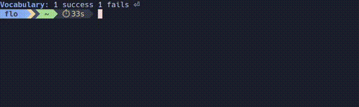

## gym 💪

Maintain your memory level with gym !  
This simple game allows you to practice mental arithmetic in your terminal. 🧠

```
 CTL+C or ESC to quit.   
 CTL+P to pass the current question.
```

### Maths

`gym --maths <MATHS> (A)ddition (S)ubtraction (M)ultiplication (D)ivision (2..) number of terms [default: 2]`

<div align="center">
  
</div>

💡 Answer can be another operation: 2 + 2 = 4 / 2 + 1 * 2  

### Keyboard
Don't tell me you've changed your layout again 😮‍💨  

`gym --keyboard <KEYBOARD> (L)etters (C)aps (N)umbers (S)ymbols (1..) nb characters [default: 3]`

<div align="center">
  
</div>

### Base

`gym --base <BASE> (B)inary (D)ecimal (H)exadecimal (10..) maximal value`

<div align="center">
  
</div>

### Vocabulary
Unbelievable! You can also practice you vocabulary in your terminal 🤯  

`gym --vocabulary`  

<div align="center">
  
</div>


💡 Press *TAB* to display obfuscated help.

This part requires a file named **vocabulary.txt** beside the gym's binary.  
Feel free to add all your words with this structure :
```
word=first_synonym,second_synonym,...
word=first_synonym,second_synonym,...
```


<div align="center">
  
</div>
 
---
### Installation

Download the release and copy **gym** and **vocabulary.txt** files in your **~/bin/** folder for instance.

`gym -h` for the full command list.  

Or clone this repo and build it with cargo:

`cargo run --release`
